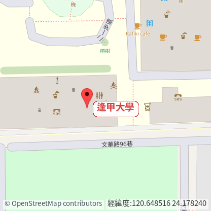
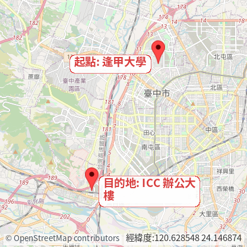
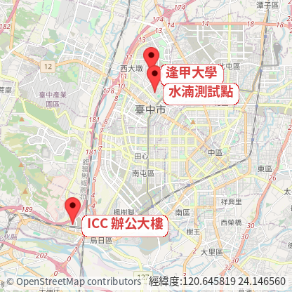
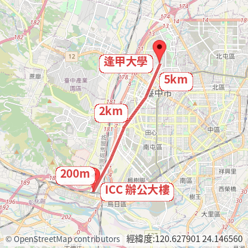
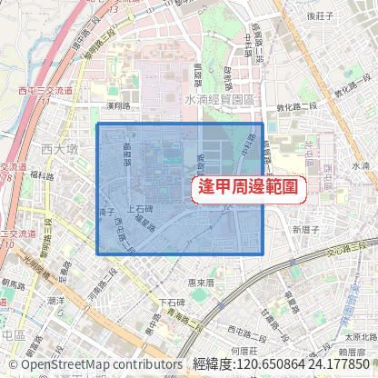

# Map Snapshot Service

把地圖變成可以保存、傳遞、快取的 PNG 圖片服務。第一版以 PHP 實作單點、雙點、多點、線段與 polygon 快照，讓使用者傳入座標與名稱，就能產生可放進報表、通知、工單或 README 的地圖截圖。

## Snapshot Examples

All example images below are generated through the service API with `basemap=osm`.

| Single Point | Two Point | Multi Point |
| --- | --- | --- |
|  |  |  |

| Line | Polygon |
| --- | --- |
|  |  |

## Demo

- Catalog: https://3wa.tw/demo/php/map/map-snapshot-service/
- AI Agent API Reference: https://3wa.tw/demo/php/map/map-snapshot-service/ai-agent-api.html
- Catalog entry file: `index.php`
- Single Point Demo: https://3wa.tw/demo/php/map/map-snapshot-service/recipes/single-point/demo.html
- Two Point Demo: https://3wa.tw/demo/php/map/map-snapshot-service/recipes/two-point/demo.html
- Multi Point Demo: https://3wa.tw/demo/php/map/map-snapshot-service/recipes/multi-point/demo.html
- Line Demo: https://3wa.tw/demo/php/map/map-snapshot-service/recipes/line/demo.html
- Polygon Demo: https://3wa.tw/demo/php/map/map-snapshot-service/recipes/polygon/demo.html
- API endpoints: `api/single-point.php`, `api/two-point.php`, `api/multi-point.php`, `api/line.php`, `api/polygon.php`

## Recipes

### Single Point Snapshot

```text
GET /api/single-point.php?latLon=24.1782252,120.6484168
  &name=逢甲大學
  &basemap=osm
  &width=416
  &height=416
```

### Two Point Snapshot

```text
GET /api/two-point.php?sLatLon=24.1782252,120.6484168
  &eLatLon=24.1111272,120.6100528
  &sName=起點: 逢甲大學
  &eName=目的地: ICC 辦公大樓
  &basemap=osm
  &width=416
  &height=416
```

### Multi Point Snapshot

```text
GET /api/multi-point.php?points=24.1782252,120.6484168;24.1111272,120.6100528;24.1700000,120.6500000
  &names=逢甲大學;ICC 辦公大樓;水湳測試點
  &basemap=osm
  &width=416
  &height=416
```

### Line Snapshot

```text
GET /api/line.php?points=24.1782252,120.6484168;24.1600000,120.6400000;24.1450000,120.6280000;24.1280000,120.6200000;24.1111272,120.6100528
  &sName=逢甲大學
  &eName=ICC 辦公大樓
  &lineNames=5km,2km,,200m
  &basemap=osm
  &width=416
  &height=416
```

### Polygon Snapshot

```text
GET /api/polygon.php?points=24.1835000,120.6422000;24.1835000,120.6578000;24.1722000,120.6578000;24.1722000,120.6422000
  &name=逢甲周邊範圍
  &basemap=osm
  &width=416
  &height=416
```

`name` is optional for polygon snapshots. Empty or omitted `name` draws the polygon without a label bubble.

POST is also supported for every endpoint:

```bash
curl -X POST 'https://3wa.tw/demo/php/map/map-snapshot-service/api/two-point.php' \
  --data-urlencode 'sLatLon=24.1782252,120.6484168' \
  --data-urlencode 'eLatLon=24.1111272,120.6100528' \
  --data-urlencode 'sName=起點: 逢甲大學' \
  --data-urlencode 'eName=目的地: ICC 辦公大樓' \
  --data-urlencode 'basemap=osm' \
  --data-urlencode 'width=416' \
  --data-urlencode 'height=416' \
  --output two-point.png
```

## Parameters

| Name | Required | Default | Description |
| --- | --- | --- | --- |
| `sLatLon` | yes | | Start coordinate, WGS84 `lat,lon`. |
| `eLatLon` | yes | | End coordinate, WGS84 `lat,lon`. |
| `sName` | no | `Start` | Start label. UTF-8 text is truncated to a safe length. |
| `eName` | no | `End` | End label. UTF-8 text is truncated to a safe length. |
| `basemap` | no | `osm` | `osm`, `google`, `google-satellite`, `google-terrain`, or `emap5`. |
| `width` | no | `416` | Output width. Clamped from `320` to `1024`. |
| `height` | no | `416` | Output height. Clamped from `240` to `1024`. |
| `padding` | no | `40` | Pixel padding around labels and pins. |
| `latLon` | single-point | | Single point coordinate, WGS84 `lat,lon`. |
| `points` | multi-point/line/polygon | | Semicolon-separated WGS84 coordinates: `lat,lon;lat,lon;...`. |
| `names` | multi-point | auto number | Semicolon-separated labels matching `points`; `labels` is accepted as an alias. |
| `lineNames` | line | | Segment labels matching each line segment. `|` and comma separators are accepted, so `5km|2km` and `5km,2km,,200m` both work. Empty segments are skipped. |

`mode` is accepted only as a legacy alias for old Google-style calls. New integrations should use `basemap`.

## Basemaps

The renderer uses a provider allowlist. User input can choose a provider key, but cannot provide arbitrary tile URLs.

| Key | Status | Tile cache | Notes |
| --- | --- | ---: | --- |
| `osm` | default | 7 days | Follows OpenStreetMap tile policy: clear User-Agent, valid Referer, no bulk download, and local caching. |
| `emap5` | available | 30 days | Uses NLSC EMAP5 WMTS. NLSC allows WMTS use but forbids bulk download. |
| `google` | available for demo/compat | 1 hour | Prefer the official Google Maps Platform Map Tiles API for production and follow attribution/cache rules. |
| `google-satellite` | available for demo/compat | 1 hour | Same caution as Google Roadmap. |
| `google-terrain` | available for demo/compat | 1 hour | Same caution as Google Roadmap. |
| `baidu` | planned | | Requires a BD-09/projection adapter before accurate rendering. |

References:

- OpenStreetMap Tile Usage Policy: https://operations.osmfoundation.org/policies/tiles/
- NLSC Taiwan Map Service Terms: https://maps.nlsc.gov.tw/pro/use_clause_en.jsp
- Google Map Tiles API Policies: https://developers.google.com/maps/documentation/tile/policies

## Caching And Safety

- Snapshot cache: `cache/{recipe}/{sha256}.png`, default TTL 30 days.
- Tile cache: `cache/tiles/{provider}/{z}/{x}/{y}.tile`, provider-specific TTL.
- Bad upstream responses are not cached. A tile is written only after GD can decode it with `imagecreatefromstring()`.
- Incomplete snapshots are not cached. If any required tile is missed, the API still returns a PNG with a warning, but it will retry instead of preserving a broken map.
- Provider attribution is rendered into the PNG when configured.
- API rate limit: public endpoint is limited per client IP per minute by simple file counters.
- Direct access to `.git`, `.superpowers`, dotfiles, and `cache/` is blocked by `.htaccess`.
- The output size is clamped to reduce CPU, memory, and upstream tile pressure.

## Repository Shape

```text
catalog/        # future catalog pages and recipe gallery
recipes/        # recipe-specific rendering and demos
renderer/       # shared PHP renderer helpers
api/            # HTTP API entrypoints
clients/        # future PHP / C# / Python wrappers
docs/           # specs, use cases, threat models
examples/       # runnable examples
assets/         # public images and shared assets
tests/          # lightweight PHP smoke tests
```

The first version is intentionally plain PHP with no framework dependency.

## Requirements

- PHP with `curl` enabled
- PHP GD extension
- A readable CJK-capable font on the host for Chinese labels

## Credits

作者：羽山秋人( https://3wa.tw )；Codex 協作開發。

## Roadmap

- Recipe catalog with copyable GET/POST examples
- PHP, C#, and Python client wrappers
- Optional authenticated/internal mode with stronger quota controls
- Official Google Maps Platform tile integration
- Baidu adapter after projection handling is implemented
