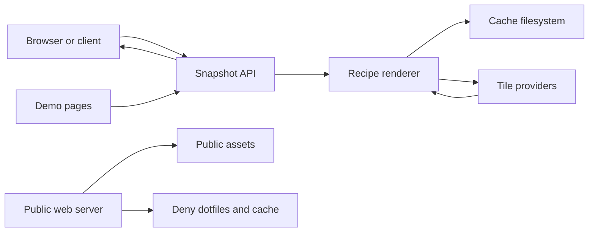

# Map Snapshot Service Threat Model

## Executive summary

The highest-risk areas are unauthenticated public rendering requests, upstream tile-provider load, cache poisoning with invalid or incomplete images, and accidental exposure of repository internals because the project runs under a web root. The current MVP reduces those risks with provider allowlists, conservative output limits, timeout-bound tile fetching, per-IP file rate limits, image-validation-before-cache, complete-tile checks before snapshot caching, and Apache deny rules for `.git`, dotfiles, `.superpowers`, and `cache/`.

## Scope and assumptions

In scope:

- Runtime PHP renderer and API: `api/`, `recipes/`, `renderer/`
- Public catalog/demo pages: `index.php`, compatibility redirect `index.html`, and `recipes/*/demo.html`
- Public assets and cache controls: `assets/`, `cache/.htaccess`, `.htaccess`
- Test coverage: `tests/two_point_renderer_test.php` and `tests/geometry_recipes_test.php`

Out of scope:

- Apache/Nginx global host configuration outside this repository
- GitHub repository permissions and deployment automation
- Future client SDKs and recipes not yet implemented

Assumptions:

- The service is internet-accessible at `https://3wa.tw/demo/php/map/map-snapshot-service/`.
- It is currently unauthenticated and intended as a public demo/product catalog.
- Coordinates and labels may be sensitive in some user workflows, even though the demo data is public.
- The host uses Apache with `.htaccess` enabled. If not, equivalent server-level deny rules are required.

Open questions:

- Should production require API keys or allowlist internal IP ranges?
- Should Google basemaps remain public, or move to an official Google Maps Platform Tile API integration?
- What daily request volume is acceptable before moving from file counters to a real quota/cache layer?

## System model

### Primary components

- Catalog UI: `index.php` presents recipe cards and a live two-point form.
- Recipe demo UI: `recipes/*/demo.html` submits GET or POST requests to the API.
- API entrypoints: `api/single-point.php`, `api/two-point.php`, `api/multi-point.php`, `api/line.php`, and `api/polygon.php` merge `$_GET` and `$_POST`, apply rate limiting, and return PNG bytes.
- Recipe modules: `recipes/single-point/`, `recipes/two-point/`, `recipes/multi-point/`, `recipes/line/`, and `recipes/polygon/` validate coordinates, clamp dimensions, compute layout, and write snapshot cache files.
- Shared renderer: `renderer/map_snapshot_renderer.php` and `recipes/_shared/geometry_snapshot.php` contain coordinate projection, provider allowlist, tile fetching, tile cache validation, tile completeness stats, attribution drawing, geometry drawing, text drawing, and cache helpers.
- Cache store: `cache/` stores generated snapshots, tile bytes, and rate-limit counters; direct web access is denied by `cache/.htaccess`.

Evidence anchors:

- `api/*.php`: request merge, PNG response, 429 response path.
- `renderer/map_snapshot_renderer.php`: `mss_basemap_definitions()`, `mss_download_map_tile()`, `mss_rate_limit_exceeded()`, cache helpers.
- `recipes/*/*_snapshot.php`: parameter validation, dimension clamp, `sha256` cache key.
- `.htaccess` and `cache/.htaccess`: deny dotfiles and cache direct access.

### Data flows and trust boundaries

- Browser or HTTP client -> `api/*.php`: untrusted GET/POST parameters over HTTPS; no auth; rate limited per remote IP; coordinates parsed with numeric bounds; labels UTF-8 checked and truncated.
- API -> recipe renderer: normalized scalar parameters; width and height clamped; basemap normalized to an allowlisted key.
- Renderer -> upstream tile providers: computed `z/x/y` tile requests over HTTPS; fixed provider templates only; curl timeouts; custom User-Agent and provider Referer.
- Renderer -> cache filesystem: generated PNG and tile bytes written under `cache/`; image bytes are decoded before tile cache writes; snapshot cache is read only if PNG signature and TTL are valid; incomplete tile renders are returned but not snapshot-cached.
- Public web -> repository files: Apache `.htaccess` blocks dotfiles, `.git`, `.superpowers`, and cache direct access.

#### Diagram

## Assets and security objectives

- Host CPU, memory, disk, and PHP worker availability: protect against render floods and oversized requests.
- Upstream tile-provider goodwill and quotas: avoid bulk downloads, retry storms, and invalid cache behavior.
- User-supplied coordinates and labels: avoid direct cache browsing and accidental logs beyond normal web server behavior.
- Repository internals and deployment metadata: prevent `.git`, `.superpowers`, dotfiles, local key files, and ignored cache artifacts from being published.
- Render integrity: prevent poisoned cache entries from serving broken or attacker-controlled non-image bytes.

## Attacker model

Capabilities:

- Send unauthenticated GET or POST requests to the public endpoint.
- Vary coordinates, labels, dimensions, and basemap keys to bypass simple cache reuse.
- Trigger upstream tile downloads by choosing uncached locations.
- Attempt to browse hidden files under the web root.

Non-capabilities:

- Cannot provide arbitrary tile URLs; basemap is an allowlisted key.
- Cannot execute uploaded code; there is no upload surface.
- Cannot directly control cache filenames; snapshot names are `sha256` hashes of normalized inputs.
- Cannot use the app to read local files; no file path parameter is exposed.

## Threat enumeration and prioritization

| Threat | Abuse path | Existing controls | Likelihood | Impact | Priority |
| --- | --- | --- | --- | --- | --- |
| Render and tile-fetch DoS | Attacker sends many uncached coordinates, multi-point payloads, or large dimensions, forcing PHP/GD work and upstream tile requests. | Per-IP file rate limits in `api/*.php`; output clamp in recipe handlers; multi-point/line/polygon point count limit; curl timeouts; local tile cache. | Medium: public unauthenticated endpoints. | High: host and upstream providers can be affected. | High |
| Upstream WMTS/tile provider ban | Public demo generates too many tile requests, lacks cache, or repeatedly fetches bad tiles. | Provider TTLs; no prefetch feature; tile cache; User-Agent/Referer; attribution in PNG; bad images not cached; incomplete snapshots not cached. | Medium: normal use is small, but bots can trigger load. | High: OSM/EMAP5/Google access may be blocked. | High |
| SSRF via custom basemap URL | Attacker tries to make renderer fetch internal/admin URLs. | No URL parameter; `mss_basemap_definitions()` is an allowlist; HTTPS-only tile URLs. | Low: no arbitrary URL entrypoint. | High if introduced later. | Medium |
| Cache poisoning with non-image or incomplete upstream response | Upstream returns HTML, ban page, corrupt bytes, or only some required tiles; service stores the broken output. | `imagecreatefromstring()` must succeed before tile bytes are cached; invalid cached bytes are unlinked on read; snapshot cache writes require complete tile stats. | Medium: upstream errors happen. | Medium: broken snapshots and persistent bad output. | Medium |
| Sensitive coordinate disclosure through direct cache browsing | User generates a sensitive map and attacker guesses or lists cache files. | `cache/.htaccess` denies direct access; filenames are `sha256`; directory indexes disabled. | Low with Apache `.htaccess`; higher if `.htaccess` disabled. | Medium: generated maps can encode sensitive locations. | Medium |
| Repository metadata exposure | Web root exposes `.git`, `.superpowers`, dotfiles, or local key artifacts. | `.htaccess` denies dotfiles and `.git`; `.gitignore` excludes keys, cache, and local state. | Medium because repo is deployed under web root. | High: source/history or keys could leak if controls fail. | High |

## Mitigations and recommendations

Existing mitigations:

- Keep tile providers in `mss_basemap_definitions()` only; do not accept arbitrary URL templates.
- Use `mss_rate_limit_exceeded()` before rendering public API responses.
- Clamp public output to `1024 x 1024`.
- Use curl connection and total timeouts for upstream calls.
- Cache OSM tiles for 7 days, EMAP5 for 30 days, Google compatibility tiles for 1 hour.
- Cache snapshots for 30 days by default.
- Decode tile bytes before caching, purge invalid cache reads, and skip snapshot cache writes when any required tile is missed.
- Render configured provider attribution directly into the PNG.
- Deny direct `.git`, dotfile, `.superpowers`, and `cache/` access with `.htaccess`.

Recommended next controls:

- Add server-level deny rules for `.git`, `.superpowers`, and `cache/`; do not rely only on `.htaccess` in production.
- Add an authenticated or API-key mode before high-volume usage.
- Add a provider-level daily quota counter, not only per-IP rate limits.
- Add cache-size pruning by total bytes and oldest modification time.
- Add structured logs for rate-limit hits, upstream fetch failures, and tile cache hit/miss counts.
- Move Google provider to the official Google Maps Platform Map Tiles API and implement required attribution/cache semantics before production use.
- Consider a self-hosted or paid OSM-derived tile provider for commercial or high-volume use.

## Focus paths for manual security review

- `api/*.php`: public entrypoints, rate-limit behavior, response headers.
- `renderer/map_snapshot_renderer.php`: provider allowlist, curl options, cache validation, rate-limit file locking.
- `recipes/*/*_snapshot.php`: coordinate validation, output clamping, point count limits, snapshot cache keys.
- `.htaccess`: dotfile and `.git` deny coverage in this hosting environment.
- `cache/.htaccess`: direct cache access denial.
- `.gitignore`: local state, cache, and key exclusion.
- `recipes/*/demo.html`: POST/GET behavior and whether demo controls encourage excessive provider switching.

## Quality check

- Covered discovered runtime entrypoints: root catalog, recipe demos, and `api/*.php`.
- Covered each trust boundary: public client to API, API to renderer, renderer to upstream tile providers, renderer to cache filesystem, web server to repo files.
- Separated runtime behavior from tests and future SDKs.
- Reflected the current public-demo assumption and noted where production auth/quota context would change risk.
- Listed open questions that materially affect risk ranking.
